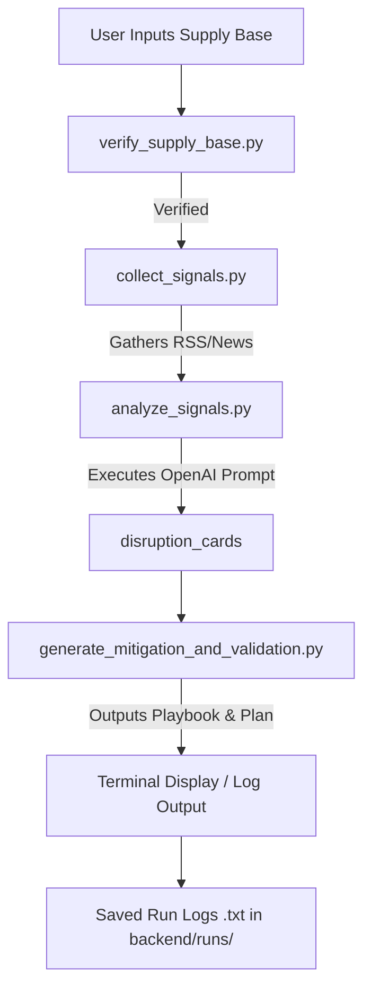

# 🛰️ Supplier Disruption Radar & Dashboard

Welcome to the **Supplier Disruption Radar & Dashboard** monorepo! This application is designed to identify, analyze, and mitigate supply chain disruptions using advanced agentic AI models paired with a modern, high-fidelity React dashboard.

---

## 📁 Repository Directory Structure

The repository is structured as a clean monorepo divided into dedicated `backend/` and `frontend/` services:

```text
/ (Repository Root)
├── backend/                  # Python Agent Backend Service
│   ├── agents/               # AI Agent Logic Core
│   │   ├── verify_supply_base.py                # Supply base validation
│   │   ├── collect_signals.py                  # Public signal collection
│   │   ├── analyze_signals.py                  # OpenAI signal analysis & card extraction
│   │   └── generate_mitigation_and_validation.py # Mitigation & validation plans
│   ├── utils/                # CLI Utilities & Custom Terminal Loggers
│   │   ├── display.py                          # Report terminal formatting
│   │   └── save_output.py                      # Persistent session outputs
│   ├── runs/                 # Persistent history of execution logs
│   ├── main.py               # Backend interactive CLI entry point
│   ├── newsapi.py            # Signal gathering API client
│   ├── data-schema.json      # Supplier/Signal standard JSON schemas
│   ├── pseudocode.txt        # Backend ingestion pipeline notes
│   ├── requirements.txt      # Python dependencies list
│   └── .env                  # API keys & local backend configurations
│
├── frontend/                 # React + Vite Frontend Dashboard
│   ├── src/
│   │   ├── components/       # Premium React Components
│   │   │   ├── Sidebar.jsx           # Fixed-side circular navigation & dark toggle
│   │   │   ├── Topbar.jsx            # User profile, notification bells, & search pills
│   │   │   ├── KpiCards.jsx          # Live supply chain KPIs & risk stats
│   │   │   ├── MapPlaceholder.jsx    # Visual geography tracker
│   │   │   └── HealthMonitorTable.jsx # Clean data table with row statuses
│   │   ├── assets/           # Dashboard static assets
│   │   ├── App.jsx           # Main CSS Grid dashboard assembly
│   │   ├── index.css         # Modern styling & Tailwind CSS imports
│   │   └── main.jsx          # React app DOM mount point
│   ├── public/               # Public assets
│   ├── package.json          # Node dependencies & Vite scripts
│   ├── vite.config.js        # Vite bundling and dev config
│   └── eslint.config.js      # JS code style lint rules
│
├── .gitignore                # Consolidated monorepo git rules
├── README.md                 # Project root documentation
└── dashboard-plan.md         # Original dashboard layout planning document
```

---

## ⚙️ Backend Setup & Execution

The backend contains a command-line interface that runs the AI Supplier Disruption Radar Agent pipeline, executing sequential verification, signal extraction, OpenAI analysis, and mitigation planning.

### 1. Prerequisites
- Python 3.10+ installed
- OpenAI API Key

### 2. Installation
Navigate to the `backend/` directory and install the requirements:
```bash
cd backend
pip install -r requirements.txt
```

### 3. Environment Configuration
Create or edit your `.env` file inside the `backend/` folder and include your OpenAI API key:
```env
OPENAI_API_KEY=your-openai-api-key-here
```

### 4. Running the Agent
Run the main script to start the interactive CLI:
```bash
python main.py
```
Upon entering a supply base (e.g., `"Aerospace Components"`), the agent will:
1. **Verify Supply Base**: Validate that the target matches industry scope.
2. **Collect Public Signals**: Gather recent disruption news and alerts.
3. **Analyze Signals**: Parse raw texts using OpenAI to construct comprehensive Disruption Cards.
4. **Generate Playbooks**: Formulate clear mitigation plans and validation strategies.
5. **Persist Reports**: Prompt to save complete report runs inside `backend/runs/`.

---

## 🎨 Frontend Setup & Execution

The frontend is a gorgeous, responsive, glassmorphic layout displaying key metrics, disruption statuses, and health monitors.

### 1. Prerequisites
- Node.js (v18 or higher)
- npm or yarn

### 2. Installation
Navigate to the `frontend/` directory and install dependencies:
```bash
cd frontend
npm install
```

### 3. Running the Dashboard (Development Mode)
Launch the development server with Hot Module Replacement (HMR):
```bash
npm run dev
```
Open your browser and navigate to the local address provided (typically `http://localhost:5173`).

---

## 🤖 Architecture Overview



### Backend Agent Components
- **`verify_supply_base`**: Validates whether the given input matches standard industry definitions.
- **`collect_signals`**: Aggregates raw disruption alerts, news, and indicators relevant to the target supply base.
- **`analyze_signals`**: Leverages OpenAI to structure raw text feeds into highly actionable "Disruption Cards" detailing risk levels, categories, and potential impact.
- **`generate_mitigation_and_validation`**: Brainstorms mitigation workarounds, alternate supplier routing, and validation steps to verify the stability of response routes.

### Frontend Dashboard Components
- **`Sidebar`**: Left-anchored icon strip featuring smooth tooltips, premium hover states, and a visual dark-mode toggle module.
- **`Topbar`**: Houses custom pill searches, system alerts, and current user identity cards.
- **`KpiCards`**: Dynamic cards tracking critical performance parameters including facility status, active alerts, and mean resolution timelines.
- **`HealthMonitorTable`**: An interactive spreadsheet showing active supply chains, criticality layers, and real-time operational risk indicators.
- **`MapPlaceholder`**: A high-impact slot ready for geospatial maps tracking real-time logistics networks.