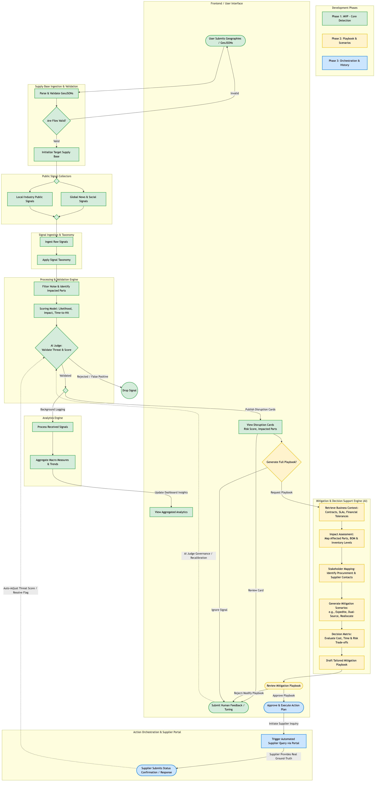
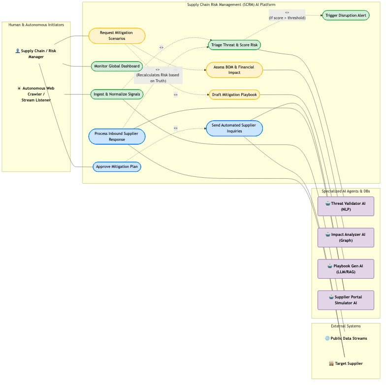
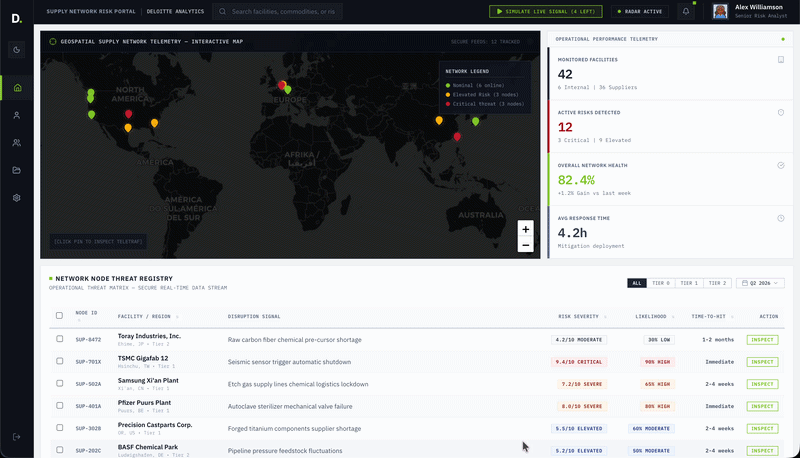

# 🛰️ Project Radar: Intelligent Supplier Disruption Radar & Decision Support Console

Project Radar is an enterprise-grade decision-support system designed to identify, analyze, and mitigate supply chain threats in real-time. Built specifically for **Boeing Commercial Airplanes** (supporting Rate 47 narrowbody/widebody assembly targets at Renton and Charleston), the platform bridges the gap between raw intelligence and closed-loop actions.

By combining advanced agentic AI pipelines with an interactive, highly responsive React cockpit, Project Radar enables procurement analysts and supply chain officers to ingest geo-coordinate records, query GraphRAG-enabled precedent databases, map complex N-tier supply ontologies, automate supplier outreach, and govern AI-generated assessments with custom human feedback loops.

---

## 🎥 Application Visuals & Architecture

### 📊 System-Wide Process Flow (Phases 1–3)


### 🗺️ System Use Case Map


### 💻 High-Fidelity Interface Preview


---

## 📁 Monorepo Architecture & Directory Structure

Project Radar is managed as a unified monorepo divided into isolated services for the Python AI Agent Backend, system documentation, and the React + Vite frontend dashboard:

```text
/ (Repository Root)
├── backend/                    # Python AI Agent Core Service
│   ├── agents/                 # Agentic AI Processing Pipeline
│   │   ├── verify_supply_base.py                # Step 1: Supply base scope validation
│   │   ├── collect_signals.py                  # Step 2: Live news API feed collector
│   │   ├── analyze_signals.py                  # Step 3: LLM Disruption Card extractor
│   │   └── generate_mitigation_and_validation.py # Step 4: Playbook & response planner
│   ├── utils/                  # Command-Line Utility Pack
│   │   ├── display.py                          # Colorized console print helpers
│   │   └── save_output.py                      # Execution log storage handlers
│   ├── runs/                   # Directory containing archived backend session logs
│   ├── main.py                 # Core CLI entry point for the interactive agent
│   ├── newsapi.py              # Public intelligence gathering connector
│   ├── data-schema.json        # Data-contract JSON validation schemas
│   ├── requirements.txt        # Python dependency manifest
│   └── .env                    # System-level API keys (OpenAI, NewsAPI)
│
├── docs/                       # Process diagrams, study guides, and visual assets
│   ├── case-study.md           # Boeing supply chain business case analysis
│   ├── essential-performance.md # Critical system design metrics
│   ├── slide-outline.md        # Technical presentation deck storyboard
│   ├── uml-process-mvp.md      # UML sequence diagram description
│   └── uml-use-case-mvp.md     # UML actor/system use case map
│
├── frontend/                   # React + Vite Production-Ready UI
│   ├── src/
│   │   ├── components/         # Highly decoupled modular components
│   │   │   ├── Sidebar.jsx           # Fixed-side tab navigation rail
│   │   │   ├── Topbar.jsx            # User credentials & global active status bar
│   │   │   ├── KpiCards.jsx          # Live financial & threat scoreboard KPIs
│   │   │   ├── MapPlaceholder.jsx    # Interactive SVG geographic node mapper
│   │   │   ├── HealthMonitorTable.jsx # Threat Registry data grid with analyst override & drawer
│   │   │   ├── BaseIngest.jsx        # Phase 1: GeoJSON validation & parser console
│   │   │   ├── MitigationPlaybooks.jsx # Mitigation Playbook workbench (scenarios, ERP, mail)
│   │   │   ├── ActionOrchestration.jsx # Phase 3: Portal outreach simulator & SAP audit logger
│   │   │   ├── AIJudgeGovernance.jsx # Governance: TPR/FPR charts & dynamic weight sliders
│   │   │   └── SignalTaxonomy.jsx    # Taxonomic distribution and risk profile matrix
│   │   ├── utils/              # Shared utility functions
│   │   │   └── riskHeuristics.js     # Taxonomy, severity, likelihood & format helpers
│   │   ├── App.jsx             # Shell framework, global states, & async DB loaders
│   │   ├── index.css           # Vanilla CSS variables & styling definitions
│   │   └── main.jsx            # Application mount point
│   ├── public/                 # Static files & local databases
│   │   └── data/               # Decoupled mock database sets (JSON format)
│   │       ├── threatRegistry.json         # Central active threats database
│   │       ├── knowledgeGraph.json         # N-tier structural node dependencies
│   │       ├── historicalPrecedents.json   # Vector-style cosine similarity records
│   │       ├── erpSystems.json             # SAP-aligned Material Masters, BOMs & pre-qualified ASLs
│   │       ├── kpiData.json               # Corporate scoreboard metric configurations
│   │       ├── mockSignals.json            # Demo live-ingest satellite signal payloads
│   │       ├── droppedSignals.json         # AI-filtered low-risk signal records
│   │       ├── playbookRecommendations.json # Structured mitigation playbook data
│   │       ├── ingestedPresets.json        # GeoJSON supply-base preset definitions
│   │       └── erpSystems.json            # ERP system configuration targets
│   ├── package.json            # Node package configurations & developer scripts
│   ├── vite.config.js          # Vite build pack bundler configurations
│   └── eslint.config.js        # Linter code quality boundaries
│
├── scripts/                    # Operational utility scripts
│   └── generate_knowledge_graph.py # Knowledge graph data generation helper
│
├── .gitignore                  # Git tracking exclusion list
└── README.md                   # Root documentation (this file)
```

---

## 🎨 Professional Interface & Design Language

Project Radar strictly adheres to a premium, color-disciplined corporate aesthetic inspired by global management consulting standards:

- **Dual Theme**: Full light/dark mode support. The dark canvas uses quiet slate-gray foundations (`#0F172A` / `#1E293B`) with frosted-glass panel boundaries; light mode uses clean white cards with `slate-100` separators.
- **Accent Color**: Deloitte-green (`#86BC25`) is applied strategically for active tab indicators, primary submit buttons, status pings, and confirmation signals — never decoratively.
- **Semantic Red**: `#EF4444` is reserved strictly for critical threat badges and severity-9+ indicators.
- **Typography**: Google Fonts `Inter` (UI labels) and `JetBrains Mono` / system monospace (data terminals) for maximum information density and scannability.
- **Motion**: Subtle `animate-ping` live-ingestion indicators and smooth transition classes — never distracting.

---

## 💻 Tab-by-Tab Feature Breakdown

### 📊 1. Risk Radar (Overview Dashboard)
- **Boardroom Scorecard**: Live reactive KPI cards tracking critical facility statuses, total unresolved threats, and mean time to resolution.
- **Geospatial Tracker**: Interactive Leaflet map marking active supply nodes, shipping ports, and threat proximity boundaries.
- **Active Threat Registry**: A comprehensive data grid detailing active disruptions with severity tiers, category tags (Force Majeure, Logistics, Geopolitical, etc.), and a slide-out **Threat Classification Inspector** drawer per row.

### 📥 2. Ingestion Pipeline (Phase 1)
- **GeoJSON Validator**: Drag-and-drop or select mock supply-base geo-coordinate files.
- **Strict Schema Validation**: Automatically parses geographic structures (validating FeatureCollection properties, coordinate arrays, and supplier metadata).
- **Log Console**: Scrolling terminal mock simulator outputting individual ingestion steps, coordinate parsing, and storage index confirmations.

### 🛠️ 3. Mitigation Playbook (Phase 2)
- **Threat-Driven Playbook Panel**: Selects the highest-severity active threat by default and renders a structured AI-generated mitigation playbook with scenario branches (A/B/C), cost-impact projections, and recommended timelines.
- **Scenario Selector**: Switch between mitigation scenarios (e.g., alternate sourcing vs. dual-track logistics) with reactive impact deltas.
- **ERP Dispatch Simulator**: One-click dispatch to mock SAP ERP terminals with a streaming log console.
- **Automated Comms Composer**: Editable supplier outreach email templates linked to the selected scenario, with send simulation.
- **FAA Regulatory Checklist**: Pre-configured compliance verification steps for replacement parts (Type Certificate, ASL Verification, FAI Queue).
- **C-Suite Boardroom Sign-Off**: Role-based approval toggles (CFO, COO, Board) per mitigation node.

### ⚡ 4. Action Orchestration (Phase 3)
- **Supplier Portal Simulator**: Launches automated queries to suppliers to confirm material availability, shipping delays, and lead times.
- **Supplier Closed Loop**: Confirmed alternate deliveries automatically adjust central threat registry risk levels and boardroom KPI scores.
- **SAP Transactional Logs**: Pre-formatted audit trails of alternate procurement orders ready for ERP integration (e.g., `ME21N` PO Creation).

### ⚖️ 5. Governance Console (AI Judge)
- **Model Validation Scorecard**: Visualizes live model telemetry parameters (True Positive Rate and False Positive Rate).
- **Dropped Signal Feed**: Tracks low-risk signals filtered out by the AI Judge to prevent alert fatigue.
- **Dynamic Weight Sliders**: Lets users adjust decision weights (Financial Risk, Delivery Impact, etc.) to tune threat assessments.
- **Human Closed Loop**: Analyst reviews and feedback logged from the threat drawer affect governance scores in real time.

---

## ⚙️ Decoupled Database Engineering

To ensure the system is completely ready for enterprise backend API integrations, the frontend has been fully decoupled from static mock data. On app boot, parallel `fetch()` routines load all data from `/public/data/`:

| File | Purpose |
|------|---------|
| `threatRegistry.json` | Central active threat records with severity & status |
| `knowledgeGraph.json` | N-tier node dependency linkages & geographic coordinates |
| `historicalPrecedents.json` | Cosine-similarity records of historic supply interventions |
| `erpSystems.json` | SAP BOMs, Material Masters & pre-qualified ASL alternates |
| `kpiData.json` | Corporate boardroom scorecard configuration |
| `mockSignals.json` | Demo live-ingest satellite signal payloads |
| `droppedSignals.json` | AI-filtered low-risk signal records for governance view |
| `playbookRecommendations.json` | Structured mitigation playbook scenarios & comms templates |

---

## 🚀 Execution & Setup Guidelines

### 🎨 Frontend Setup
1. Navigate into the `frontend` folder:
    ```bash
    cd frontend
    ```
2. Install dependencies:
    ```bash
    npm install
    ```
3. Launch the local dev server:
    ```bash
    npm run dev
    ```
4. Open the web console in your browser at `http://localhost:5173`.

### 🐍 Backend Setup
1. Navigate into the `backend` folder:
    ```bash
    cd backend
    ```
2. Create and configure a virtual environment:
    ```bash
    python -m venv venv
    source venv/bin/activate  # On Windows: venv\Scripts\activate
    ```
3. Install the required packages:
    ```bash
    pip install -r requirements.txt
    ```
4. Configure environment variables (create a `.env` file):
    ```env
    OPENAI_API_KEY=your_openai_api_key_here
    NEWS_API_KEY=your_newsapi_key_here
    ```
5. Run the command-line agent:
    ```bash
    python main.py
    ```

---

## 🔒 Verification & Compliance

- **Zero Lint Errors**: The frontend passes `eslint .` with **0 errors and 0 warnings** against the React Hooks and ES6 rule sets.
- **Clean Production Build**: `npm run build` compiles the full 1,750-module graph in ~103ms with zero errors via Vite 8.
- **API-Ready Architecture**: No hardcoded business objects inside rendering components — all data flows through JSON fetch contracts, ready for live API substitution.
- **Color Discipline**: Deloitte-green and semantic red are the only accent colors; all other UI uses slate/neutral tokens for a professional, corporate-ready aesthetic.