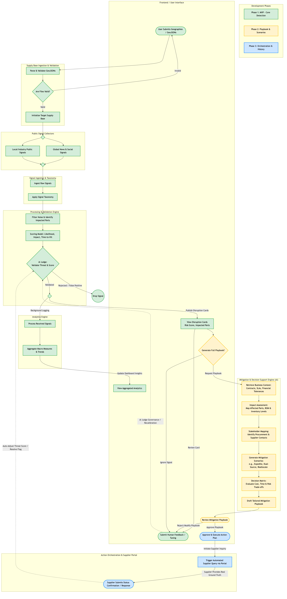
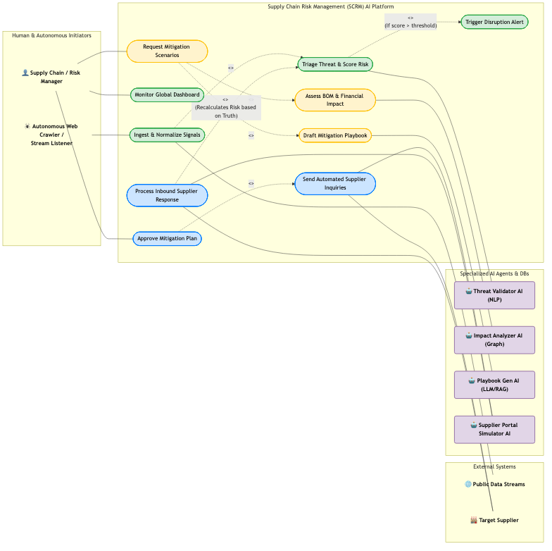
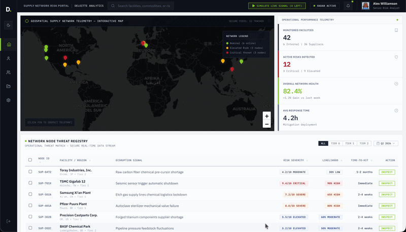

# 🛰️ Project Radar: Intelligent Supplier Disruption Radar & Decision Support Console

Project Radar is an enterprise-grade decision-support system designed to identify, analyze, and mitigate supply chain threats in real-time. Built specifically for **Boeing Commercial Airplanes** (supporting Rate 47 narrowbody/widebody assembly targets at Renton and Charleston), the platform bridges the gap between raw intelligence and closed-loop actions.

By combining advanced agentic AI pipelines with an interactive, highly responsive React cockpit, Project Radar enables procurement analysts and supply chain officers to ingest geo-coordinate records, query GraphRAG-enabled precedent databases, map complex N-tier supply ontologies, automate supplier outreach, and govern AI-generated assessments with custom human feedback loops.

---

## 🎥 Application Visuals & Architecture

### 📊 System-Wide Process Flow (Phases 1–3)


### 🗺️ System Use Case Map


### 💻 High-Fidelity Interface Preview


---

## 📁 Monorepo Architecture & Directory Structure

Project Radar is managed as a unified monorepo divided into isolated services for the Python AI Agent Backend, system documentation, and the React + Vite frontend dashboard:

```text
/ (Repository Root)
├── archive/                    # Archived files not needed at runtime (historical analyses, large CSV lists, and offline processors)
│   ├── root/                   # Original setup and planning scratchpads
│   ├── scratch/                # Codebase generation/cleanup scripts
│   └── scripts/                # Original supplier lists, data parsers, and scheduler logic
│
├── backend/                    # Python AI Agent Core Service
│   ├── agents/                 # Agentic AI Processing Pipeline
│   │   ├── verify_supply_base.py                # Step 1: Supply base scope validation
│   │   ├── collect_signals.py                  # Step 2: Live news API feed collector
│   │   ├── analyze_signals.py                  # Step 3: LLM Disruption Card extractor
│   │   └── generate_mitigation_and_validation.py # Step 4: Playbook & response planner
│   ├── utils/                  # Command-Line Utility Pack
│   │   ├── display.py                          # Colorized console print helpers
│   │   └── save_output.py                      # Execution log storage handlers
│   ├── runs/                   # Directory containing archived backend session logs
│   ├── main.py                 # Core CLI entry point and FastAPI server endpoints
│   ├── requirements.txt        # Python dependency manifest
│   └── .env                    # System-level API keys (OpenAI, NewsAPI)
│
├── docs/                       # Process diagrams, study guides, and visual assets
│   ├── case-study.md           # Boeing supply chain business case analysis
│   ├── essential-performance.md # Critical system design metrics
│   ├── slide-outline.md        # Technical presentation deck storyboard
│   ├── uml-process-mvp.md      # UML sequence diagram description
│   └── uml-use-case-mvp.md     # UML actor/system use case map
│
├── frontend/                   # React + Vite Production-Ready UI
│   ├── src/
│   │   ├── components/         # Decoupled UI components (Sidebar, Topbar, HealthMonitorTable, etc.)
│   │   ├── data/               # Hardcoded static starting databases imported on load
│   │   │   ├── threatRegistry.json           # Central active threats (30 signals baseline)
│   │   │   ├── knowledgeGraph.json           # N-tier structural node dependencies
│   │   │   ├── historicalPrecedents.json     # Historic similarity records
│   │   │   ├── erpSystems.json               # SAP pre-qualified alternates & BOMs
│   │   │   ├── kpiData.json                  # Scorecard metrics configuration
│   │   │   ├── mockSignals.json              # Live-ingest satellite signals
│   │   │   ├── droppedSignals.json           # AI-filtered low-risk signals
│   │   │   └── playbookRecommendations.json   # Structured playbooks and email templates
│   │   ├── utils/              # Risk evaluation heuristics
│   │   ├── App.jsx             # React layout framework, states & fetch/SSE hook listeners
│   │   ├── index.css           # Custom Vanilla CSS visual tokens & glassmorphic styles
│   │   └── main.jsx            # Application entry mount point
│   ├── package.json            # Vite package dependencies
│   ├── vite.config.js          # Vite build environment configuration
│   └── eslint.config.js        # Strict React Hook quality check rules
│
├── scripts/                    # Operational utility scripts
│   ├── generate_knowledge_graph.py # Knowledge graph data generation helper
│   ├── google_news_batch_processor.py # Google News RSS Batch Processor & Translator
│   └── validate_schemas.py     # JSON schema validation helper
│
├── .gitignore                  # Git tracking exclusion list
└── README.md                   # Root documentation (this file)
```

---

## 🎨 Professional Interface & Design Language

Project Radar strictly adheres to a premium, color-disciplined corporate aesthetic inspired by global management consulting standards:

- **Dual Theme**: Full light/dark mode support. The dark canvas uses quiet slate-gray foundations (`#0F172A` / `#1E293B`) with frosted-glass panel boundaries; light mode uses clean white cards with `slate-100` separators.
- **Aesthetic Custom Tooltips**: Default browser tooltips are fully replaced with custom React + CSS hover cards featuring high-contrast borders, dynamic entry transitions (`scale` + `opacity`), separate indicators (Crimson, Blue, Amber), and detailed Monospaced **Computation Models** detailing how the Risk Severity, Likelihood, and Time-to-hit values are generated.
- **Accent Color**: Deloitte-green (`#86BC25`) is applied strategically for active tab indicators, primary submit buttons, status pings, and confirmation signals — never decoratively.
- **Semantic Red**: `#EF4444` is reserved strictly for critical threat badges and severity-9+ indicators.
- **Typography**: Google Fonts `Inter` (UI labels) and `JetBrains Mono` / system monospace (data terminals) for maximum information density and scannability.
- **Motion**: Subtle `animate-ping` live-ingestion indicators and smooth transition classes — never distracting.

---

## 💻 Tab-by-Tab Feature Breakdown

### 📊 1. Risk Radar (Overview Dashboard)
- **Boardroom Scorecard**: Live reactive KPI cards tracking critical facility statuses, total unresolved threats, and mean time to resolution.
- **Geospatial Tracker**: Interactive Leaflet map marking active supply nodes, shipping ports, and threat proximity boundaries.
- **Active Threat Registry**: A comprehensive data grid detailing active disruptions with severity tiers, category tags (Force Majeure, Logistics, Geopolitical, etc.), and a slide-out **Threat Classification Inspector** drawer per row. Included custom interactive hover card tooltips explaining metric calculations.

### 📥 2. Ingestion Pipeline (Phase 1)
- **GeoJSON Validator**: Drag-and-drop or select mock supply-base geo-coordinate files.
- **Strict Schema Validation**: Automatically parses geographic structures (validating FeatureCollection properties, coordinate arrays, and supplier metadata).
- **Log Console**: Scrolling terminal mock simulator outputting individual ingestion steps, coordinate parsing, and storage index confirmations.

### 🛠️ 3. Mitigation Playbook (Phase 2)
- **Threat-Driven Playbook Panel**: Selects the highest-severity active threat by default and renders a structured AI-generated mitigation playbook with scenario branches (A/B/C), cost-impact projections, and recommended timelines.
- **Scenario Selector**: Switch between mitigation scenarios (e.g., alternate sourcing vs. dual-track logistics) with reactive impact deltas.
- **ERP Dispatch Simulator**: One-click dispatch to mock SAP ERP terminals with a streaming log console.
- **Automated Comms Composer**: Editable supplier outreach email templates linked to the selected scenario, with send simulation.
- **FAA Regulatory Checklist**: Pre-configured compliance verification steps for replacement parts (Type Certificate, ASL Verification, FAI Queue).
- **C-Suite Boardroom Sign-Off**: Role-based approval toggles (CFO, COO, Board) per mitigation node.

### ⚡ 4. Action Orchestration (Phase 3)
- **Supplier Portal Simulator**: Launches automated queries to suppliers to confirm material availability, shipping delays, and lead times.
- **Supplier Closed Loop**: Confirmed alternate deliveries automatically adjust central threat registry risk levels and boardroom KPI scores.
- **SAP Transactional Logs**: Pre-formatted audit trails of alternate procurement orders ready for ERP integration (e.g., `ME21N` PO Creation).

### ⚖️ 5. Governance Console (AI Judge)
- **Model Validation Scorecard**: Visualizes live model telemetry parameters (True Positive Rate and False Positive Rate).
- **Dropped Signal Feed**: Tracks low-risk signals filtered out by the AI Judge to prevent alert fatigue.
- **Dynamic Weight Sliders**: Lets users adjust decision weights (Financial Risk, Delivery Impact, etc.) to tune threat assessments.
- **Human Closed Loop**: Analyst reviews and feedback logged from the threat drawer affect governance scores in real time.

---

## 🛰️ Signal Clustering & State Deduplication Architecture

Project Radar implements an intelligent signal clustering and state deduplication subsystem to process raw news streams and simulated telemetry alerts without polluting the boardroom cockpit:

1. **Jaccard Similarity Clustering ($\ge 65\%$ Threshold)**: 
   - Uses a custom token-based Jaccard similarity and exact core-disruption matching helper on the backend (`main.py` and `google_news_batch_processor.py`).
   - If two alerts target the same facility and share $\ge 65\%$ word similarity, they are clustered into a single parent active threat card (dynamically incrementing the `(X articles)` count and appending to `sources`).
   - If the disruption signals represent different incidents (e.g. a logistics rail strike vs. a power grid freeze), they bypass clustering and safely coexist as distinct threat rows in the registry table.
2. **Robust Splitting Heuristics**:
   - Cleans the governance risk briefing logs using a robust case-insensitive and whitespace-flexible regular expression split: `re.split(r'\s*Additional report\s*', clean_desc, flags=re.IGNORECASE)`.
   - This prevents duplicate legacy reports and keeps the Executive Governance Briefing panel to a clean, concise single-paragraph core description.
3. **Frontend State Deduplication**:
   - The React core in `App.jsx` dynamically intercepts live SSE streams (`new_signal` events) and mock post-simulation returns.
   - It filters out previous entries of the updated threat by ID before prepending the mapped signal to the top of the table state:
     ```javascript
     setThreatRows(prev => {
       const filtered = prev.filter(t => t.id !== mappedSignal.id);
       return [mappedSignal, ...filtered];
     });
     ```
     This prevents duplicate row generation in the UI data grid.

---

## ⚙️ Decoupled Database Engineering

To ensure the system is completely ready for enterprise backend API integrations, the frontend has been fully decoupled from static mock data. On app boot, parallel `fetch()` routines load all data from `/public/data/`:

| File | Purpose |
|------|---------|
| `threatRegistry.json` | Central active threat records with severity & status |
| `knowledgeGraph.json` | N-tier node dependency linkages & geographic coordinates |
| `historicalPrecedents.json` | Cosine-similarity records of historic supply interventions |
| `erpSystems.json` | SAP BOMs, Material Masters & pre-qualified ASL alternates |
| `kpiData.json` | Corporate boardroom scorecard configuration |
| `mockSignals.json` | Demo live-ingest satellite signal payloads |
| `droppedSignals.json` | AI-filtered low-risk signal records for governance view |
| `playbookRecommendations.json` | Structured mitigation playbook scenarios & comms templates |
| `ingestedPresets.json` | GeoJSON supply-base preset definitions |
| `erpSystems.json` | ERP system configuration targets |

---

## 🚀 Execution & Setup Guidelines

### 🎨 Frontend Setup
1. Navigate into the `frontend` folder:
    ```bash
    cd frontend
    ```
2. Install dependencies:
    ```bash
    npm install
    ```
3. Launch the local dev server:
    ```bash
    npm run dev
    ```
4. Open the web console in your browser at `http://localhost:5173`.

### 🐍 Backend Setup
1. Navigate into the `backend` folder:
    ```bash
    cd backend
    ```
2. Create and configure a virtual environment:
    ```bash
    python -m venv venv
    source venv/bin/activate  # On Windows: venv\Scripts\activate
    ```
3. Install the required packages:
    ```bash
    pip install -r requirements.txt
    ```
4. Configure environment variables (create a `.env` file):
    ```env
    OPENAI_API_KEY=your_openai_api_key_here
    NEWS_API_KEY=your_newsapi_key_here
    ```
5. Run the command-line agent:
    ```bash
    python main.py
    ```

### 🛰️ Transient Live News Ingestion & Simulation
Starting data is fully hardcoded inside the frontend bundles under `frontend/src/data/` to guarantee instant load times and deterministic state. Dynamic operations use the following transient patterns:
1. **Real-time News Feed**: Clicking the Deloitte-green **Fetch Real News** button in the Topbar calls the backend `@app.get("/api/real-news")` endpoint. This fetches, processes, and formats live news on-demand and returns them directly to the frontend state without modifying local JSON database files on disk.
2. **Signal Simulation**: Clicking the **Simulate Live Signal** button in the overview panel invokes `POST /api/signals/simulate`, which bypasses Jaccard clustering to dynamically inject unique alerts as new rows into the active interface context.

---

## 🔒 Verification & Compliance

- **Zero Lint Errors**: The frontend passes `eslint .` with **0 errors and 0 warnings** against the React Hooks and ES6 rule sets.
- **Robust Failure Resilience & Dynamic Fallbacks**: 
  - Injected dynamic playbook and C-suite telemetry generators in `MitigationPlaybooks` and `HealthMonitorTable` components, preventing blank pages or rendering crashes for unmapped supplier threats.
  - Formulated full-stage signal pipeline timelines and active crawler logs dynamically for all active threats using fallback synthesis loops.
- **Interactive Deletion Control**: Embedded a red custom-styled **DELETE** button on each registry row (fully integrated with confirmation boxes and `e.stopPropagation` event bubbling checks) to remove signals in real-time from the active dashboard state.
- **Custom Aesthetic Tooltips**: Built high-fidelity interactive CSS hover-cards with glassmorphic designs instead of standard browser tooltip titles, outlining exactly how critical metrics are processed.
- **Clean Production Build**: `npm run build` compiles the full 1,750-module graph in ~103ms with zero errors via Vite 8.
- **API-Ready Architecture**: No hardcoded business objects inside rendering components — all data flows through JSON fetch contracts, ready for live API substitution.
- **Color Discipline**: Deloitte-green and semantic red are the only accent colors; all other UI uses slate/neutral tokens for a professional, corporate-ready aesthetic.