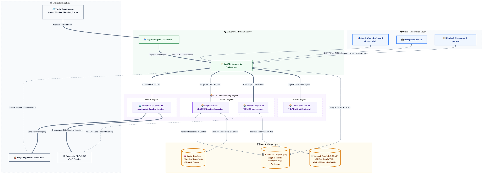

# Ideal State Application Architecture Diagram

This document describes the multi-layered Application Architecture for the SCRM AI Platform in its ideal state. It illustrates the separation of concerns between client visualization, API orchestrations, background AI validators, databases, and enterprise/external integrations.

## Rendered Application Architecture Diagram

## Diagram Source (Mermaid)

```mermaid
%%{init: {
  'theme': 'base',
  'themeVariables': {
    'fontFamily': 'Inter, system-ui, -apple-system, sans-serif',
    'fontSize': '13px',
    'background': '#ffffff',
    'primaryColor': '#F8FAFC',
    'primaryTextColor': '#0F172A',
    'primaryBorderColor': '#E2E8F0',
    'lineColor': '#64748B',
    'secondaryColor': '#F1F5F9',
    'tertiaryColor': '#FFFFFF',
    'nodeBorder': '#CBD5E1'
  },
  'flowchart': {
    'defaultRenderer': 'dagre'
  }
}}%%
flowchart TD
    %% Layers & Components
    
    subgraph Layer_Client ["🖥️ Client / Presentation Layer"]
        direction LR
        Dashboard["📊 Supply Chain Dashboard<br>(React / Vite)"]:::client
        CardViewer["📇 Disruption Card UI"]:::client
        PlaybookPanel["📋 Playbook Customizer & Approval"]:::client
    end

    subgraph Layer_API ["🔌 API & Orchestration Gateway"]
        direction TB
        APIGateway["⚡ FastAPI Gateway & Orchestrator"]:::api
        IngestService["📥 Ingestion Pipeline Controller"]:::api
    end

    subgraph Layer_AI ["🤖 AI & Core Processing Engines"]
        direction TB
        subgraph Ingest_AI ["Phase 1 Engines"]
            direction LR
            ThreatAI["🤖 Threat Validator AI<br>(NLP Entity & Sentiment)"]:::ai
        end
        subgraph Strategy_AI ["Phase 2 Engines"]
            direction LR
            ImpactAI["🤖 Impact Analyzer AI<br>(BOM Graph Mapping)"]:::ai
            PlaybookAI["🤖 Playbook Gen AI<br>(RAG / Mitigation Scenarios)"]:::ai
        end
        subgraph Execution_AI ["Phase 3 Engines"]
            direction LR
            OrchestratorAI["🤖 Execution & Comms AI<br>(Automated Supplier Queries)"]:::ai
        end
    end

    subgraph Layer_Data ["💾 Data & Storage Layer"]
        direction LR
        PostgresDB[("🗄️ Relational DB (Postgres)<br>- Supplier Profiles<br>- Disruption Logs<br>- Playbooks")]:::db
        GraphDB[("🕸️ Network Graph DB (Neo4j)<br>- N-Tier Supply Web<br>- Bill of Materials (BOM)")]:::db
        VectorDB[("🧠 Vector Database<br>- Historical Precedents<br>- SLAs & Contracts")]:::db
    end

    subgraph Layer_External ["⚙️ External Integrations"]
        direction TB
        PublicFeeds["🌐 Public Data Streams<br>(News, Weather, Maritime, Ports)"]:::external
        ERPSystem["⚙️ Enterprise ERP / MRP<br>(SAP, Oracle)"]:::external
        SupplierPortal["🏭 Target Supplier Portal / Email"]:::external
    end

    %% --- RELATIONSHIPS / INTERACTIONS ---
    
    %% Client to API
    Dashboard & CardViewer & PlaybookPanel <--> |REST APIs / WebSockets| APIGateway
    
    %% External to Ingestion
    PublicFeeds ==> |Webhook / RSS Stream| IngestService
    IngestService ==> |Ingested Raw Signals| APIGateway
    
    %% API to DBs
    APIGateway <--> |Query & Persist Metadata| PostgresDB
    
    %% API to AI Engines
    APIGateway ===> |Signal Validation Request| ThreatAI
    APIGateway ===> |BOM Impact Calculation| ImpactAI
    APIGateway ===> |Mitigation Draft Request| PlaybookAI
    APIGateway ===> |Execution Workflows| OrchestratorAI

    %% AI Engines to DBs
    ImpactAI <---> |Traverse Supply Chain Web| GraphDB
    PlaybookAI <---> |Retrieve Precedents & Context| VectorDB & PostgresDB
    
    %% AI / Gateway to External Integrations
    ImpactAI -.-> |Pull Live Lead Times / Inventory| ERPSystem
    OrchestratorAI ===> |Trigger Auto-PO / Routing Updates| ERPSystem
    OrchestratorAI ===> |Send Supplier Inquiry| SupplierPortal
    SupplierPortal -.-> |Process Response Ground-Truth| APIGateway

    %% Styling Classes
    classDef client fill:#EFF6FF,stroke:#3B82F6,stroke-width:2px,color:#1E3A8A,font-weight:bold
    classDef api fill:#F0FDF4,stroke:#15803D,stroke-width:2px,color:#14532D,font-weight:bold
    classDef ai fill:#F5F3FF,stroke:#7C3AED,stroke-width:2px,color:#4C1D95,font-weight:bold
    classDef db fill:#FFFBEB,stroke:#D97706,stroke-width:2px,color:#78350F,font-weight:bold
    classDef external fill:#F8FAFC,stroke:#64748B,stroke-width:2px,color:#0F172A,font-weight:bold

    %% Subgraph Styling
    style Layer_Client fill:#F8FAFC,stroke:#E2E8F0,stroke-width:1px,stroke-dasharray: 4
    style Layer_API fill:#F4FBF7,stroke:#DCFCE7,stroke-width:1px
    style Layer_AI fill:#FAF5FF,stroke:#F3E8FF,stroke-width:1px
    style Ingest_AI fill:#FFFFFF,stroke:#E9D5FF,stroke-width:1px,stroke-dasharray: 2
    style Strategy_AI fill:#FFFFFF,stroke:#E9D5FF,stroke-width:1px,stroke-dasharray: 2
    style Execution_AI fill:#FFFFFF,stroke:#E9D5FF,stroke-width:1px,stroke-dasharray: 2
    style Layer_Data fill:#FEFBF0,stroke:#FEF3C7,stroke-width:1px
    style Layer_External fill:#F8FAFC,stroke:#E2E8F0,stroke-width:1px,stroke-dasharray: 4
```

