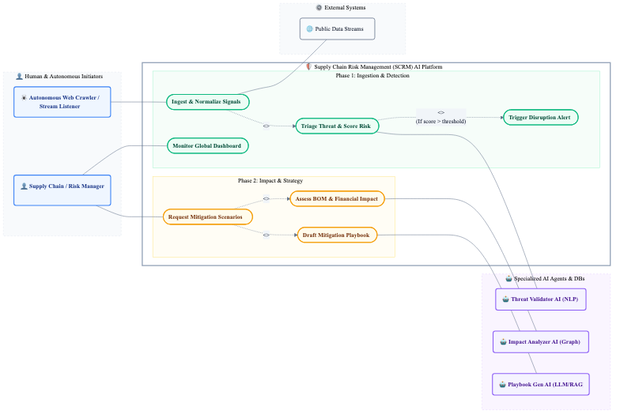
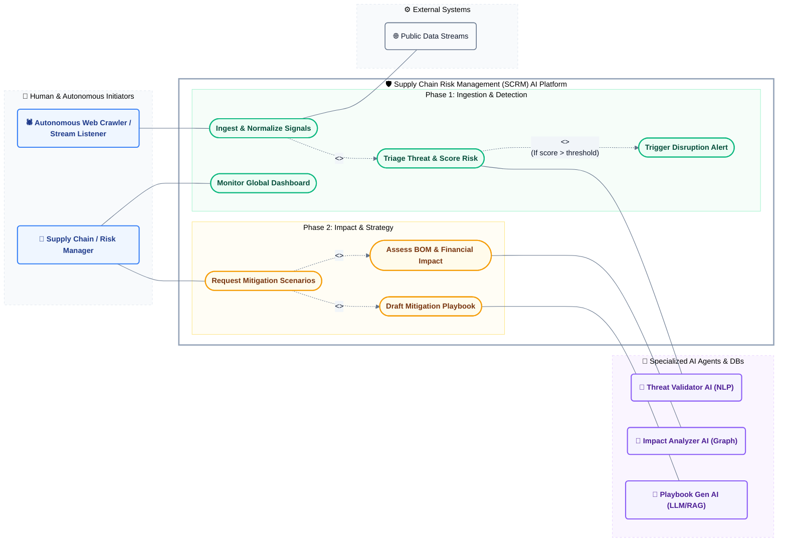

# Refined SCRM AI Platform MVP Use Case Diagram

This document contains the refined, presentation-ready UML Use Case diagram for the MVP version of the Supply Chain Risk Management (SCRM) AI Platform. It has been styled with a custom, high-fidelity color scheme and organized into Phase 1 & Phase 2 boundaries.

## Rendered MVP Use Case Diagram

## Diagram Source (Mermaid)

