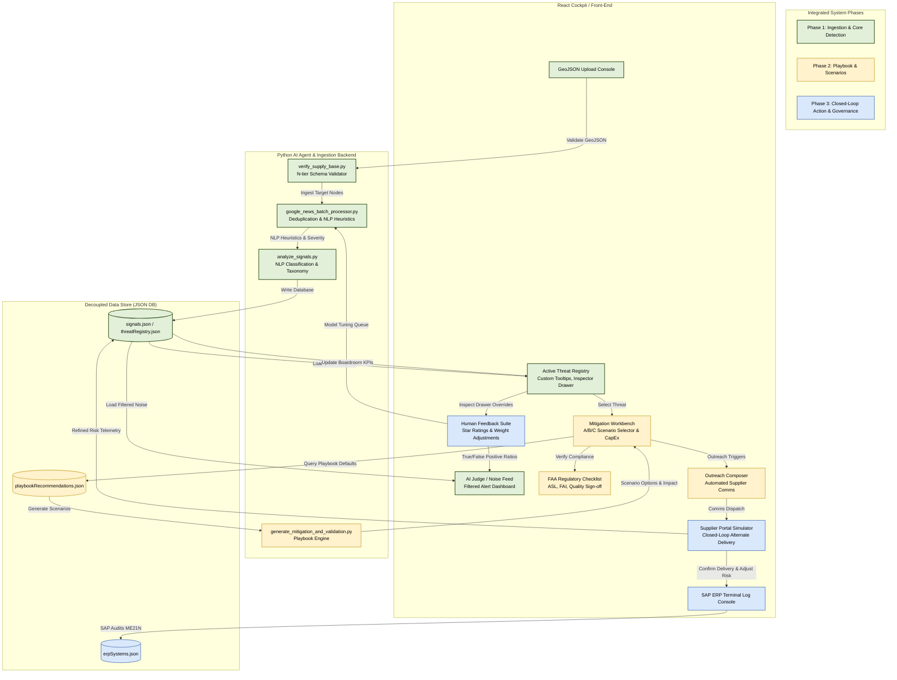

```mermaid
flowchart TD
    %% Phase Legend
    subgraph Legend ["Integrated System Phases"]
        direction LR
        L1[Phase 1: Ingestion & Core Detection]:::phase1
        L2[Phase 2: Playbook & Scenarios]:::phase2
        L3[Phase 3: Closed-Loop Action & Governance]:::phase3
    end

    subgraph Frontend["React Cockpit / Front-End"]
        U1[GeoJSON Upload Console]:::phase1
        U2[Active Threat Registry<br>Custom Tooltips, Inspector Drawer]:::phase1
        U3[AI Judge / Noise Feed<br>Filtered Alert Dashboard]:::phase1
        U4[Mitigation Workbench<br>A/B/C Scenario Selector & CapEx]:::phase2
        U5[FAA Regulatory Checklist<br>ASL, FAI, Quality Sign-off]:::phase2
        U6[Outreach Composer<br>Automated Supplier Comms]:::phase2
        U7[SAP ERP Terminal Log Console]:::phase3
        U8[Supplier Portal Simulator<br>Closed-Loop Alternate Delivery]:::phase3
        U9[Human Feedback Suite<br>Star Ratings & Weight Adjustments]:::phase3
    end

    subgraph Backend["Python AI Agent & Ingestion Backend"]
        B1[google_news_batch_processor.py<br>Deduplication & NLP Heuristics]:::phase1
        B2[verify_supply_base.py<br>N-tier Schema Validator]:::phase1
        B3[analyze_signals.py<br>NLP Classification & Taxonomy]:::phase1
        B4[generate_mitigation_and_validation.py<br>Playbook Engine]:::phase2
    end

    subgraph DataStore["Decoupled Data Store (JSON DB)"]
        D1[(signals.json / threatRegistry.json)]:::phase1
        D2[(playbookRecommendations.json)]:::phase2
        D3[(erpSystems.json)]:::phase3
    end

    %% Phase 1: Ingestion & Core Detection Flow
    U1 -->|Validate GeoJSON| B2
    B2 -->|Ingest Target Nodes| B1
    B1 -->|NLP Heuristics & Severity| B3
    B3 -->|Write Database| D1
    D1 -->|Load Active Registry| U2
    D1 -->|Load Filtered Noise| U3

    %% Phase 2: Playbook & Scenarios Flow
    U2 -->|Select Threat| U4
    U4 -->|Query Playbook Defaults| D2
    D2 -->|Generate Scenarios| B4
    B4 -->|Scenario Options & Impact| U4
    U4 -->|Verify Compliance| U5
    U4 -->|Outreach Triggers| U6

    %% Phase 3: Action Orchestration, Closed-Loop & Governance Flow
    U6 -->|Comms Dispatch| U8
    U8 -->|Confirm Delivery & Adjust Risk| U7
    U7 -->|SAP Audits ME21N| D3
    U8 -->|Refined Risk Telemetry| D1
    D1 -->|Update Boardroom KPIs| U2
    
    %% Human-in-the-Loop & Model Tuning
    U2 -->|Inspect Drawer Overrides| U9
    U9 -->|Model Tuning Queue| B1
    U9 -->|True/False Positive Ratios| U3

    %% Styling Classes
    classDef phase1 fill:#e2f0d9,stroke:#385723,stroke-width:2px,color:#000;
    classDef phase2 fill:#fff2cc,stroke:#d6b656,stroke-width:2px,color:#000;
    classDef phase3 fill:#dae8fc,stroke:#6c8ebf,stroke-width:2px,color:#000;
```
