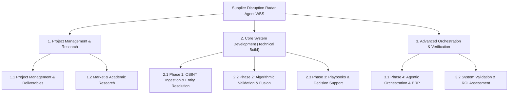

# Supplier Disruption Radar Agent - Work Breakdown Structure (WBS)

This document outlines the 3-level Work Breakdown Structure (WBS) for the **Supplier Disruption Radar Agent** project, developed for the **APS1013** course under the guidance of Professor Stephen Armstrong. The WBS is synthesized from the project workstreams defined in the [Project Charter](file:///Users/epheriami/Downloads/Projects/aps1013/project/docs/reports/charter.md) and the technical development phases specified in the [Deep Research Document](file:///Users/epheriami/Downloads/Projects/aps1013/project/docs/reports/deep-research.md).

### Detailed WBS Gantt Chart (June 5 to June 10)

The following schedule tracks all 3-level WBS tasks day-by-day between June 5th and June 10th, 2026.

| WBS Task / Activity | Jun 5 | Jun 6 | Jun 7 | Jun 8 | Jun 9 | Jun 10 |
| :--- | :---: | :---: | :---: | :---: | :---: | :---: |
| **Track 1 - PM and Research** | | | | | | |
| 1.1.2 Preliminary Presentation Delivery | █ | | | | | |
| 1.2.1 Supply Chain Practices Study | █ | | | | | |
| 1.2.2 OSINT Dataset Identification | █ | | | | | |
| 1.2.3 Threat Taxonomy Definition | █ | █ | | | | |
| 1.1.3 Final Presentation Structure | | | | | █ | █ |
| 1.1.4 Final Project Report Synthesis | | | | | █ | █ |
| 1.1.5 Project Coordination and Handoff | █ | █ | █ | █ | █ | █ |
| **Track 2 - Core Dev (Phase 1 & 2)** | | | | | | |
| 2.1.1 API Integration with Data Brokers | █ | | | | | |
| 2.1.2 Web Scraping & Link Analysis Engine | | █ | | | | |
| 2.1.3 Entity Resolution Engine | | █ | | | | |
| 2.2.1 NLP Disruption Classification (BERT/GPT) | | | █ | | | |
| 2.2.2 Supply Chain Knowledge Graph Database | | | █ | | | |
| 2.2.3 Multimodal Data Fusion Engine | | | | █ | | |
| **Track 2 - Core Dev (Phase 3)** | | | | | | |
| 2.3.1 Risk-Based Alerting (RBA) Configuration | | | | █ | | |
| 2.3.2 Playbook Digitization & Codification | | | | █ | █ | |
| 2.3.3 Analyst Decision Support Interface | | | | | █ | █ |
| **Track 3 - Advanced Orchestration** | | | | | | |
| 3.1.1 Sourcing Agent Deployment | | | | | █ | |
| 3.1.2 ERP & Sourcing Systems Integration | | | | | █ | █ |
| 3.1.3 Agentic Governance & Guardrails | | | | | | █ |
| **Track 3 - Validation** | | | | | | |
| 3.2.1 Baseline Metric Collection | | █ | █ | | | |
| 3.2.2 Scenario-Based Accuracy Validation | | | | | | █ |
| 3.2.3 Business Value & ROI Scorecard Audit | | | | | | █ |

---

## Level 1: Major Track / Phase
## Level 2: Work Package / Component
## Level 3: Specific Task / Activity

---

### 1. Project Management & Research Track

*   **1.1 Project Management & Deliverables**
    *   **1.1.1 Project Charter Definition & Alignment**: Draft, socialize, and baseline the Project Charter ([charter.md](file:///Users/epheriami/Downloads/Projects/aps1013/project/docs/reports/charter.md)) outlining scope boundaries, team structure, and timeline.
    *   **1.1.2 Preliminary Presentation Delivery**: Create progress updates and review draft architecture with Deloitte mentors to ensure alignment with corporate standards.
    *   **1.1.3 Final Presentation Structure & Material**: Construct the executive slide deck, live/recorded demo scenarios, and technical appendix for the final presentation.
    *   **1.1.4 Final Project Report Synthesis**: Compile the comprehensive technical and business report, integrating the final taxonomy, scoring model, disruption card portfolio, and playbooks.
    *   **1.1.5 Project Coordination & Handoff**: Conduct weekly sprint syncs, resource allocation checks, and final artifact archival.

*   **1.2 Market & Academic Research**
    *   **1.2.1 Supply Chain Practices Study**: Analyze current SCRM landscape models (e.g., Exiger, Everstream, Prewave) and document the TPRM Paradox.
    *   **1.2.2 Industry Sourcing & OSINT Dataset Identification**: Identify public databases, NGO records, regulatory feeds (OFAC, UN lists), and corporate registries for open-source intelligence.
    *   **1.2.3 Threat Taxonomy Definition**: Align external risk classifications with the **DoD SCRM Taxonomy Version 2.1** (12 primary categories and 124 subcategories).

---

### 2. Core System Development Track (Technical Build)

*   **2.1 Phase 1: OSINT Ingestion & Entity Resolution (Months 1-3)**
    *   **2.1.1 API Integration with Data Brokers**: Establish data connections with public compliance feeds, news aggregators, and vulnerability databases.
    *   **2.1.2 Web Scraping & Link Analysis Engine**: Implement targeted scraping routines and relationship-mapping models to capture sub-tier supplier links.
    *   **2.1.3 Entity Resolution Engine**: Deploy deterministic and probabilistic algorithms to resolve inconsistent supplier names into unified master entity profiles.

*   **2.2 Phase 2: Algorithmic Validation & Fusion (Months 4-6)**
    *   **2.2.1 NLP Disruption Classification (BERT/GPT)**: Deploy transformer-based models to parse multilingual data streams and classify threats into the taxonomy.
    *   **2.2.2 Supply Chain Knowledge Graph Database**: Model the N-tier BOM, SBOM (software dependencies), and facility locations in a graph database.
    *   **2.2.3 Multimodal Data Fusion Engine**: Cross-correlate semantic NLP signals with structured operational data (telemetry, weather, financials) using GNNs.

*   **2.3 Phase 3: Playbooks & Decision Support (Months 7-9)**
    *   **2.3.1 Risk-Based Alerting (RBA) Configuration**: Setup alert prioritization based on asset criticality, business impact, and risk thresholds.
    *   **2.3.2 Playbook Digitization & Codification**: Translate manual mitigation workflows (alternate sourcing, dual routing) into dynamic digital playbooks.
    *   **2.3.3 Analyst Decision Support Interface**: Develop a dashboard to display disruption cards, risk scores, stop-line exposure estimates, and SHAP explainability variables.

---

### 3. Advanced Orchestration & Verification Track

*   **3.1 Phase 4: Agentic Orchestration & ERP (Months 10-12)**
    *   **3.1.1 Sourcing Agent Deployment**: Configure and deploy autonomous agents (e.g., Salesforce Agentforce) to run alternate supplier evaluations and capacity checks.
    *   **3.1.2 ERP & Sourcing Systems Integration**: Establish secure API loops to ERP systems (SAP, Oracle) to trigger automated safety stock replenishment or purchase orders.
    *   **3.1.3 Agentic Governance & Guardrails**: Implement the "AI Judge" interceptor and defense-in-depth monitoring to validate agent decisions against risk boundaries.

*   **3.2 System Validation & ROI Assessment**
    *   **3.2.1 Baseline Metric Collection**: Measure initial state metrics, including Time-to-Identify, Time-to-Recover (TTR), and expedited shipping occurrences.
    *   **3.2.2 Scenario-Based Accuracy Validation**: Run test cases against the system using historical events to build and verify a portfolio of 10-15 disruption cards.
    *   **3.2.3 Business Value & ROI Scorecard Audit**: Audit performance against the balanced scorecard (Perfect Order Percentage, Cash-to-Cash Cycle Time, Cost to Serve).
