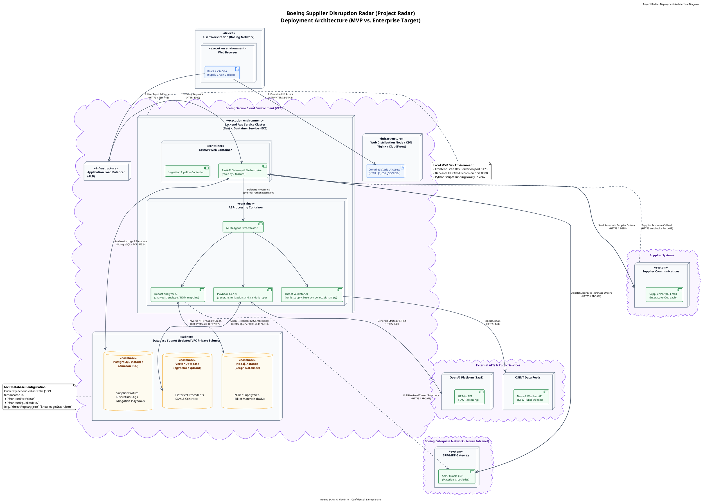

# Deployment Architecture Diagram (MVP vs. Enterprise Target)

This document describes the Deployment Architecture for the SCRM AI Platform (**Project Radar**). It showcases the physical deployment nodes, execution containers, network isolation layers, database subnets, and external enterprise integrations. 

To bridge the gap between development and production, the diagram maps out the current **Local MVP Development Environment** alongside the target **Boeing Secure Cloud Environment (VPC)**.

## Rendered Deployment Diagram

Once compiled using a PlantUML renderer, the deployment diagram will represent the physical server layout:


---

## Deployment Node Specifications

### 1. Client / Presentation Layer
* **User Workstation (Boeing Network)**: A standard corporate PC/laptop connected to the Boeing Intranet/VPN.
* **Web Browser**: Runs the client-side single page application (React + Vite). All rendering, UI state updates, Jaccard signal deduplication, and map rendering are handled client-side.
* **Web Distribution / CDN**: Static web assets (HTML, compiled JavaScript, and CSS bundles) are distributed globally via Nginx or a cloud CDN (e.g., AWS CloudFront) to minimize page load times.

### 2. Application & Orchestration Layer
* **Application Load Balancer (ALB)**: Acts as the secure HTTPS gateway to route client REST and Server-Sent Events (SSE) traffic from the browser into the containerized backend.
* **FastAPI Web Container (Uvicorn)**: The primary python API service running on Uvicorn. It exposes the REST interfaces, serves live news SSE streams, and handles file uploads (GeoJSON validation).
* **AI Processing Container**: An isolated task execution cluster (running on Amazon ECS or EKS) that hosts the Python agentic frameworks:
  * **Threat Validator Agent** (`verify_supply_base.py`, `collect_signals.py`)
  * **Impact Analyzer Agent** (`analyze_signals.py` and BOM graph mapping engine)
  * **Playbook Gen Agent** (`generate_mitigation_and_validation.py` for RAG-driven scenario planning)

### 3. Data & Storage Layer (VPC Private Subnet)
To ensure maximum security, the databases are isolated inside a private subnet inaccessible from the public internet:
* **Relational DB (PostgreSQL RDS)**: Stores transactional metadata, user roles, active/resolved disruption logs, audit trails, and playbook recommendation templates.
* **Neo4j Graph Database**: Tracks the structural N-tier supply chain network graph, indexing relationship linkages between direct (Tier-1) suppliers and sub-tier component manufacturers (Tier-2 to Tier-4) mapped to Boeing's assembly plants.
* **Vector Database (pgvector / Qdrant)**: Stores high-dimensional vector embeddings of contract documents, Service Level Agreements (SLAs), and historical playbook precedents for contextual RAG retrieval.

### 4. External Integrations & Intranet Connectors
* **OpenAI API**: Interfaced via secure HTTPS for executing RAG synthesis, intent parsing, and generating natural-language mitigation strategy playbooks.
* **OSINT Data Feeds**: Connects to public RSS data streams, news aggregators, and weather telemetry to continuously feed raw signals into the ingestion controller.
* **Boeing ERP/MRP (SAP / Oracle)**: Accessed via an intranet VPN gateway. It allows the platform to verify live inventory lead times, check certified suppliers against the Approved Supplier List (ASL), and dispatch procurement adjustments (e.g., ME21N PO updates) back to corporate records.
* **Supplier Communications Gateway**: Sends automated inquiries to suppliers via email/SMTP or the supplier portal, listening for response callbacks to automatically recalculate operational risk levels.

---

## Network Protocols & Ports

| Origin Node | Target Node | Protocol / Method | Destination Port | Purpose |
|:---|:---|:---|:---|:---|
| Web Browser | Web Distribution / CDN | HTTPS / GET | `443` | Fetches static React client application code. |
| Web Browser | Application Load Balancer | HTTPS / REST / SSE | `443` | User-driven actions and real-time streaming updates. |
| Load Balancer (ALB) | FastAPI Web Container | HTTP | `8000` | Proxies user commands to FastAPI/Uvicorn backend. |
| FastAPI Backend | PostgreSQL (RDS) | PostgreSQL / TCP | `5432` | Persists logs, app state, and configurations. |
| AI Agent | Neo4j Graph DB | Bolt Protocol / TCP | `7687` | Traverses N-tier supply chain graph networks. |
| AI Agent | Vector Database | HTTP / REST | `5432` / `6333` | RAG search over historical playbooks and contracts. |
| AI Agent | OpenAI Platform | HTTPS / POST | `443` | Dispatches prompts to GPT-4o for strategic playbook drafting. |
| Threat Agent | OSINT API Feeds | HTTPS / GET | `443` | Polls public feeds for disruption signals. |
| FastAPI Backend | Boeing ERP System | HTTPS / RFC API | Dynamic | Connects to SAP/Oracle ERP for PO updates and FAI queries. |
| FastAPI Backend | Supplier Systems | HTTPS / SMTP | `443` / `25` | Dispatches emails/portal notifications to external suppliers. |
| Supplier Portal | FastAPI Backend | HTTPS / Webhook | `443` | Receives updates regarding supplier capacity confirmations. |

---

## MVP vs. Enterprise Production Delta

The monorepo is currently configured to run in a decoupled MVP state to support offline demonstrations and zero-configuration setups:

1. **Database Layer Transition**:
   * *MVP State*: All relational tables, supply graphs, and precedents are saved as local JSON collections in `frontend/src/data/` (e.g. `knowledgeGraph.json`, `threatRegistry.json`).
   * *Enterprise Target*: Fully migrated to Amazon RDS (PostgreSQL), Neo4j Enterprise Cloud, and Qdrant/pgvector.
2. **Server Separation**:
   * *MVP State*: React runs via a Vite development server on `localhost:5173`; FastAPI runs on `localhost:8000`.
   * *Enterprise Target*: Compiled React client is served via Nginx/CloudFront CDN, connecting to containerized FastAPI servers running in an autoscaling ECS/EKS VPC.

---

## Diagram Source (PlantUML)

The diagram source code is stored in [uml-deployment.puml](file:///Users/epheriami/Downloads/Projects/aps1013/project/docs/uml-deployment.puml). To compile it, run:
```bash
plantuml docs/uml-deployment.puml
```


