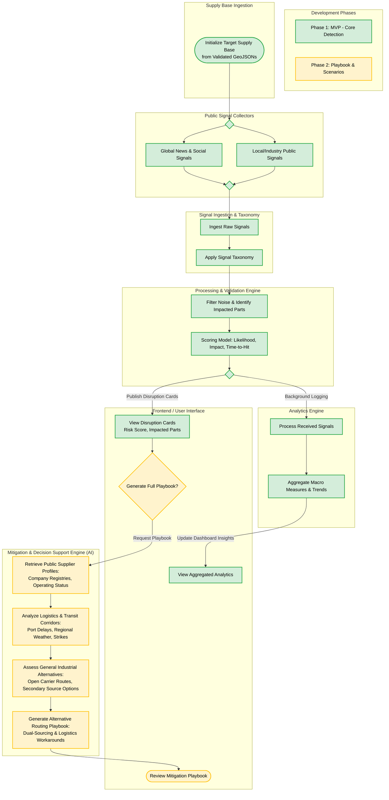

```mermaid
flowchart TD
    %% Phase Legend
    subgraph Legend ["Development Phases"]
        direction LR
        L1[Phase 1: MVP - Core Detection]:::phase1
        L2[Phase 2: Playbook & Scenarios]:::phase2
    end

    subgraph Frontend["Frontend / User Interface"]
        U2[View Disruption Cards<br>Risk Score, Impacted Parts]:::phase1
        U4[View Aggregated Analytics]:::phase1
        
        U3{Generate Full Playbook?}:::phase2
        U5([Review Mitigation Playbook]):::phase2
    end

    subgraph BaseIngestion["Supply Base Ingestion"]
        I3([Initialize Target Supply Base<br>from Validated GeoJSONs]):::phase1
    end

    subgraph Collectors["Public Signal Collectors"]
        C_Fork{" "}:::phase1
        C1[Global News & Social Signals]:::phase1
        C2[Local/Industry Public Signals]:::phase1
        C_Join{" "}:::phase1
    end

    subgraph SignalIngestion["Signal Ingestion & Taxonomy"]
        S1[Ingest Raw Signals]:::phase1
        S2[Apply Signal Taxonomy]:::phase1
    end

    subgraph Processing["Processing & Validation Engine"]
        P1[Filter Noise & Identify Impacted Parts]:::phase1
        P2[Scoring Model: Likelihood, Impact, Time-to-Hit]:::phase1
        P_Fork{" "}:::phase1
    end

    subgraph Analytics["Analytics Engine"]
        A1[Process Received Signals]:::phase1
        A2[Aggregate Macro Measures & Trends]:::phase1
    end

    subgraph Playbook["Mitigation & Decision Support Engine (AI)"]
        G1[Retrieve Public Supplier Profiles:<br>Company Registries, Operating Status]:::phase2
        G2[Analyze Logistics & Transit Corridors:<br>Port Delays, Regional Weather, Strikes]:::phase2
        G3[Assess General Industrial Alternatives:<br>Open Carrier Routes, Secondary Source Options]:::phase2
        G4[Generate Alternative Routing Playbook:<br>Dual-Sourcing & Logistics Workarounds]:::phase2
    end

    %% Base Initialization Flow
    I3 --> C_Fork

    %% Collection Flow (Concurrent)
    C_Fork --> C1
    C_Fork --> C2
    C1 --> C_Join
    C2 --> C_Join

    %% Signal Ingestion & Taxonomy Flow
    C_Join --> S1
    S1 --> S2
    S2 --> P1

    %% Processing Flow
    P1 --> P2
    P2 --> P_Fork

    %% The Split: Real-Time Stream vs Background Analytics
    P_Fork -->|Publish Disruption Cards| U2
    P_Fork -->|Background Logging| A1

    %% Analytics Flow
    A1 --> A2
    A2 -->|Update Dashboard Insights| U4

    %% Expanded On-Demand Decision Support & Playbook Flow
    U2 --> U3
    U3 -- Request Playbook --> G1
    G1 --> G2
    G2 --> G3
    G3 --> G4
    G4 --> U5

    %% Styling Classes
    classDef phase1 fill:#d4edda,stroke:#28a745,stroke-width:2px,color:#000;
    classDef phase2 fill:#fff3cd,stroke:#ffc107,stroke-width:2px,color:#000;
```