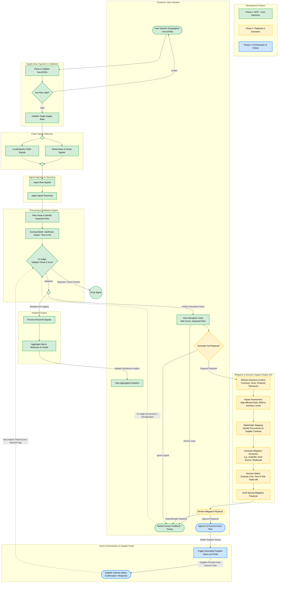

```mermaid
flowchart TD
    %% Phase Legend
    subgraph Legend ["Development Phases"]
        direction LR
        L1[Phase 1: MVP - Core Detection]:::phase1
        L2[Phase 2: Playbook & Scenarios]:::phase2
        L3[Phase 3: Orchestration & History]:::phase3
    end

    subgraph Frontend["Frontend / User Interface"]
        U1([User Submits Geographies / GeoJSONs]):::phase1
        U2[View Disruption Cards<br>Risk Score, Impacted Parts]:::phase1
        U4[View Aggregated Analytics]:::phase1
        U6([Submit Human Feedback / Tuning]):::phase1
        
        U3{Generate Full Playbook?}:::phase2
        U5([Review Mitigation Playbook]):::phase2
        
        U7([Approve & Execute Action Plan]):::phase3
    end

    subgraph BaseIngestion["Supply Base Ingestion & Validation"]
        I1[Parse & Validate GeoJSONs]:::phase1
        I2{Are Files Valid?}:::phase1
        I3[Initialize Target Supply Base]:::phase1
    end

    subgraph Collectors["Public Signal Collectors"]
        C_Fork{" "}:::phase1
        C1[Global News & Social Signals]:::phase1
        C2[Local/Industry Public Signals]:::phase1
        C_Join{" "}:::phase1
    end

    subgraph SignalIngestion["Signal Ingestion & Taxonomy"]
        S1[Ingest Raw Signals]:::phase1
        S2[Apply Signal Taxonomy]:::phase1
    end

    subgraph Processing["Processing & Validation Engine"]
        P1[Filter Noise & Identify Impacted Parts]:::phase1
        P2[Scoring Model: Likelihood, Impact, Time-to-Hit]:::phase1
        P3{AI Judge:<br>Validate Threat & Score}:::phase1
        P_Fork{" "}:::phase1
    end

    subgraph Analytics["Analytics Engine"]
        A1[Process Received Signals]:::phase1
        A2[Aggregate Macro Measures & Trends]:::phase1
    end

    subgraph Playbook["Mitigation & Decision Support Engine (AI)"]
        G1[Retrieve Business Context:<br>Contracts, SLAs, Financial Tolerances]:::phase2
        G2[Impact Assessment:<br>Map Affected Parts, BOM & Inventory Levels]:::phase2
        G3[Stakeholder Mapping:<br>Identify Procurement & Supplier Contacts]:::phase2
        G4[Generate Mitigation Scenarios:<br>e.g., Expedite, Dual-Source, Reallocate]:::phase2
        G5[Decision Matrix:<br>Evaluate Cost, Time & Risk Trade-offs]:::phase2
        G6[Draft Tailored Mitigation Playbook]:::phase2
    end

    subgraph Execution["Action Orchestration & Supplier Portal"]
        E1[Trigger Automated Supplier Query via Portal]:::phase3
        E2([Supplier Submits Status Confirmation / Response]):::phase3
    end

    %% Base Initialization Flow
    U1 --> I1
    I1 --> I2
    I2 -- Invalid --> U1
    I2 -- Valid --> I3
    I3 --> C_Fork

    %% Collection Flow (Concurrent)
    C_Fork --> C1
    C_Fork --> C2
    C1 --> C_Join
    C2 --> C_Join

    %% Signal Ingestion & Taxonomy Flow
    C_Join --> S1
    S1 --> S2
    S2 --> P1

    %% Processing Flow
    P1 --> P2
    P2 --> P3
    
    %% AI Judge Validation Step & Closed Feedback Loop
    P3 -- Rejected / False Positive --> Drop((Drop Signal)):::phase1
    P3 -- Validated --> P_Fork

    %% The Split: Real-Time Stream vs Background Analytics
    P_Fork -->|Publish Disruption Cards| U2
    P_Fork -->|Background Logging| A1

    %% Analytics Flow
    A1 --> A2
    A2 -->|Update Dashboard Insights| U4

    %% Expanded On-Demand Decision Support & Playbook Flow
    U2 --> U3
    U3 -- Request Playbook --> G1
    G1 --> G2
    G2 --> G3
    G3 --> G4
    G4 --> G5
    G5 --> G6
    G6 --> U5
    
    %% Execution & Action Orchestration Flow
    U5 -- Approve Playbook --> U7
    U7 -->|Initiate Supplier Inquiry| E1
    E1 -->|Supplier Provides Real Ground-Truth| E2
    
    %% The Critical Closed Loop
    E2 -.->|Auto-Adjust Threat Score / Resolve Flag| P3

    %% Human Feedback Loop
    U2 -- Review Card --> U6
    U5 -- Reject/Modify Playbook --> U6
    U3 -- Ignore Signal --> U6
    U6 -.->|AI Judge Governance / Recalibration| P3

    %% Styling Classes
    classDef phase1 fill:#d4edda,stroke:#28a745,stroke-width:2px,color:#000;
    classDef phase2 fill:#fff3cd,stroke:#ffc107,stroke-width:2px,color:#000;
    classDef phase3 fill:#cce5ff,stroke:#007bff,stroke-width:2px,color:#000;
```