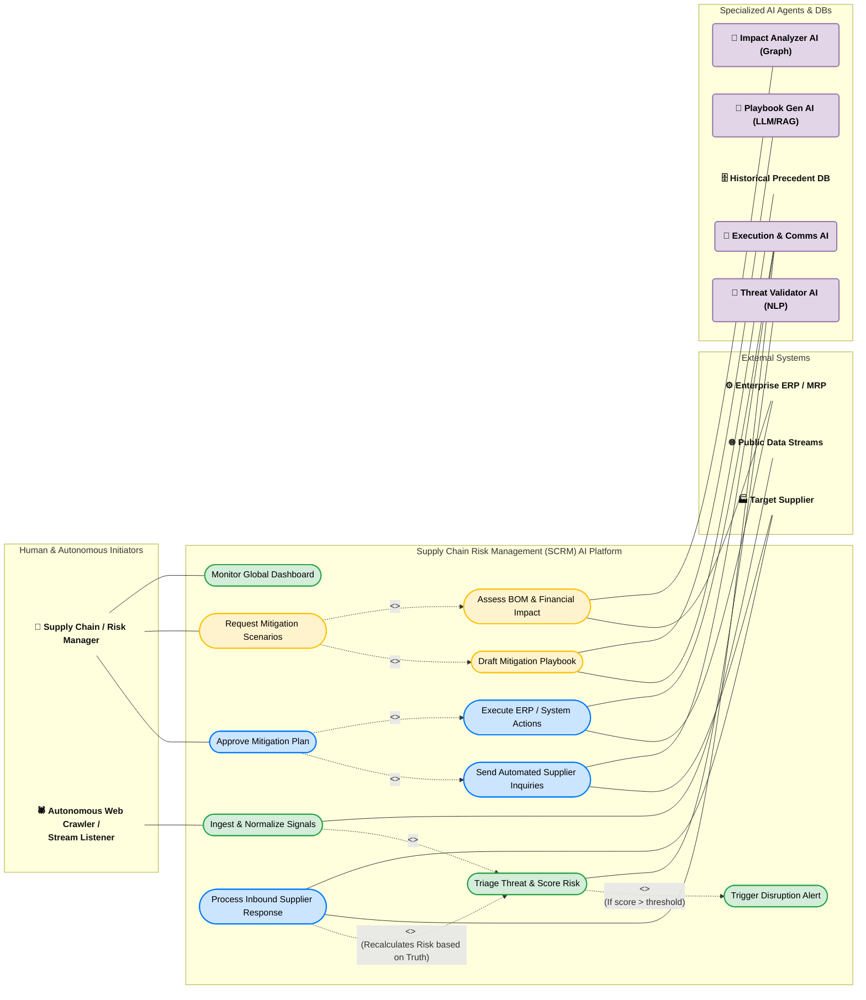

```mermaid
flowchart LR
    %% Primary Actors (Initiators) on the Left
    subgraph Initiators ["Human & Autonomous Initiators"]
        direction TB
        Manager("👤 Supply Chain / Risk Manager"):::actor
        Crawler("🕷️ Autonomous Web Crawler /<br>Stream Listener"):::actor
    end

    %% System Boundary
    subgraph SCRM ["Supply Chain Risk Management (SCRM) AI Platform"]
        direction TB
        
        %% Phase 1: Ingestion & Detection
        UC_Ingest([Ingest & Normalize Signals]):::phase1
        UC_Triage([Triage Threat & Score Risk]):::phase1
        UC_Alert([Trigger Disruption Alert]):::phase1
        UC_Monitor([Monitor Global Dashboard]):::phase1
        
        %% Phase 2: Impact & Strategy
        UC_ReqScenario([Request Mitigation Scenarios]):::phase2
        UC_AssessBOM([Assess BOM & Financial Impact]):::phase2
        UC_DraftPlaybook([Draft Mitigation Playbook]):::phase2
        
        %% Phase 3: Execution & Closed Loop
        UC_Approve([Approve Mitigation Plan]):::phase3
        UC_ExecSystem([Execute ERP / System Actions]):::phase3
        UC_AutoComms([Send Automated Supplier Inquiries]):::phase3
        UC_InboundResp([Process Inbound Supplier Response]):::phase3
    end

    %% Secondary Actors & Specialized AI Agents on the Right
    subgraph ExternalSystems ["External Systems"]
        direction TB
        DataSources("🌐 Public Data Streams"):::actor
        ERPSystem("⚙️ Enterprise ERP / MRP"):::actor
        Supplier("🏭 Target Supplier"):::actor
    end

    subgraph AIAgents ["Specialized AI Agents & DBs"]
        direction TB
        ThreatAI("🤖 Threat Validator AI (NLP)"):::aiActor
        ImpactAI("🤖 Impact Analyzer AI (Graph)"):::aiActor
        GenAI("🤖 Playbook Gen AI (LLM/RAG)"):::aiActor
        OrchestratorAI("🤖 Execution & Comms AI"):::aiActor
        HistDB("🗄️ Historical Precedent DB"):::actor
    end

    %% --- ASSOCIATIONS (Initiators to Use Cases) ---
    Manager --- UC_Monitor
    Manager --- UC_ReqScenario
    Manager --- UC_Approve
    
    Crawler --- UC_Ingest

    %% --- ASSOCIATIONS (Use Cases to Secondary Actors/Agents) ---
    UC_Ingest --- DataSources
    UC_Triage --- ThreatAI
    
    UC_AssessBOM --- ImpactAI
    UC_AssessBOM --- ERPSystem
    
    UC_DraftPlaybook --- GenAI
    UC_DraftPlaybook --- HistDB
    
    UC_ExecSystem --- OrchestratorAI
    UC_ExecSystem --- ERPSystem
    
    UC_AutoComms --- OrchestratorAI
    UC_AutoComms --- Supplier
    
    UC_InboundResp --- Supplier
    UC_InboundResp --- OrchestratorAI

    %% --- DEPENDENCIES (Includes / Extends) ---
    
    %% Ingestion flow
    UC_Ingest -. "<<include>>" .-> UC_Triage
    UC_Triage -. "<<extend>> <br>(If score > threshold)" .-> UC_Alert
    
    %% Scenario Generation flow
    UC_ReqScenario -. "<<include>>" .-> UC_AssessBOM
    UC_ReqScenario -. "<<include>>" .-> UC_DraftPlaybook
    
    %% Execution flow
    UC_Approve -. "<<include>>" .-> UC_ExecSystem
    UC_Approve -. "<<include>>" .-> UC_AutoComms
    
    %% Closed Loop Feedback
    UC_InboundResp -. "<<extend>> <br>(Recalculates Risk based on Truth)" .-> UC_Triage

    %% Styling Classes
    classDef actor fill:transparent,stroke:none,font-weight:bold,color:#111;
    classDef aiActor fill:#e1d5e7,stroke:#9673a6,stroke-width:2px,font-weight:bold,color:#000;
    classDef phase1 fill:#d4edda,stroke:#28a745,stroke-width:2px,color:#000;
    classDef phase2 fill:#fff3cd,stroke:#ffc107,stroke-width:2px,color:#000;
    classDef phase3 fill:#cce5ff,stroke:#007bff,stroke-width:2px,color:#000;
```