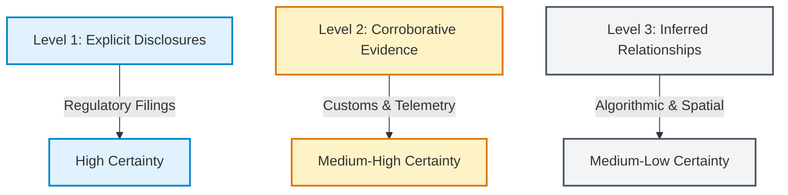

# Boeing Commercial Airplanes: Forensic Supply Chain Mapping & Multi-Tier OSINT Investigation

This document presents a comprehensive, multi-tier supply chain mapping and forensic operational risk analysis for **Boeing Commercial Airplanes**. The findings are derived using Open Source Intelligence (OSINT) methodologies, blending corporate filings, regulatory databases, international customs manifests, and logistical tracking networks.

---

## 1. OSINT Investigation Methodology & Data Reliability Framework

To map Boeing's complex aerospace supply chain with high fidelity, this investigation establishes a rigorous data verification spectrum. This separates explicitly disclosed corporate relationships from those inferred through operational telemetry or structural logistics.



### Level 1: Explicit Disclosures (High Certainty)
*   **SEC Form 10-K & Regulation S-K Disclosures:** Public filings from suppliers where Boeing represents $>10\%$ of their consolidated annual revenues. This provides ironclad, legally binding financial connections.
*   **SEC Form SD (Conflict Minerals Reports):** Under Section 1502 of the Dodd-Frank Act, Boeing must annually disclose the exact smelters and refiners processing Gold, Tantalum, Tin, and Tungsten (3TG) in its supply chain. This is the primary tool for mapping Tier 3 and Tier 4 raw material nodes.
*   **FAA Parts Manufacturer Approvals (PMA):** Federal Aviation Administration databases detailing approved replacement and modification parts. PMA records explicitly link component manufacturers to specific Boeing aircraft type certificates (e.g., B737, B787).
*   **Official Contract Awards & Press Releases:** Direct corporate statements from Boeing or its tier-1 integrators confirming major program selections (e.g., 777X wing tooling contracts).

### Level 2: Corroborative Evidence (Medium-High Certainty)
*   **Global Maritime Customs Records (Bills of Lading):** Manifest data tracking maritime shipments to Boeing cargo hubs (e.g., Port of Tacoma, Port of Charleston). We trace unique consignee names (e.g., *"Boeing Commercial Airplanes"*, *"Boeing South Carolina"*) and shippers to confirm bulk component sourcing (e.g., carbon fiber rolls, large titanium forgings).
*   **Flight Tracking & Telemetry (Dreamlifter Operations):** Automated Dependent Surveillance-Broadcast (ADS-B) telemetry tracking Boeing's LCF (Large Cargo Freighter) "Dreamlifter" fleet. Flights directly correlate with oversized component movement between Everett (KPAE), Charleston (KCHS), Nagoya (RJGG - wings), and Taranto-Grottaglie (LIBG - horizontal stabilizers).
*   **FAA Airworthiness Directives (AD):** Regulatory mandates targeting specific components or manufacturing batches, identifying the underlying sub-tier supplier responsible for the affected assembly (e.g., composite skin delamination issues).

### Level 3: Inferred Relationships (Medium-Low Certainty)
*   **Spatial Cluster Analysis:** Co-location within specialized aerospace hubs (e.g., Wichita, KS; Toulouse, France; Nagoya, Japan) suggesting local sub-tier integration.
*   **Industrial Patent Analysis:** Cross-referencing Boeing patents on advanced alloys or composite structures with manufacturing facilities possessing the unique tooling or chemical processes to produce them.
*   **Historical Sub-Tier Alignment:** Estimating supplier chains based on legacy defense contracts where sub-tier supplier disclosures are more detailed than in commercial sectors.

---

## 2. Multi-Tier Supply Chain Data Inventory

The following structured inventory maps key suppliers across the four data horizons, detailed with core components, primary OSINT verification sources, and estimated operational/financial materiality.

| Entity Name | Supply Chain Tier | Core Component/Material Supplied | Primary Verification Source | Estimated Materiality |
| :--- | :---: | :--- | :--- | :---: |
| **Spirit AeroSystems, Inc.** | **Tier 1** | Fuselage shells (B737, B787 forward), pylons, wing components | SEC Form 10-K (Spirit lists Boeing as ~60-70% of revenue), FAA PMA, rail manifests | **High** (SPOF for B737 Max) |
| **CFM International** *(GE/Safran JV)* | **Tier 1** | LEAP-1B Turbofan Engines | FAA Type Certificate Data Sheets (TCDS), Boeing PR, SEC 10-K | **High** (Exclusive B737 Max Engine) |
| **GE Aerospace** | **Tier 1** | GEnx & GE9X Engines, electrical power systems | FAA TCDS, SEC Form 10-K, airline configuration sheets | **High** (Dominant Widebody Propulsion) |
| **Mitsubishi Heavy Industries (MHI)** | **Tier 1** | Composite wing boxes (B787) | Japanese METI Aerospace Reports, Dreamlifter flight telemetry | **High** (Exclusive B787 Wing Integrator) |
| **Kawasaki Heavy Industries (KHI)** | **Tier 1** | Forward fuselage sections, landing gear wheel wells (B787, 777) | Corporate annual reports, Dreamlifter telemetry, customs records | **High** (Key Widebody Structural Partner) |
| **Subaru Corporation** *(Aerospace Div.)* | **Tier 1** | Center wing boxes, wing-to-body integration (B787, 777) | Japanese METI Aerospace Reports, corporate disclosures | **Medium-High** (Critical Structural Node) |
| **Leonardo S.p.A.** | **Tier 1** | Fuselage Sections (B787 mid-body sections 44 & 46) | Italian Ministry of Defense disclosures, Dreamlifter flight tracking | **High** (Key B787 Structural Partner) |
| **Collins Aerospace** *(RTX)* | **Tier 1** | Avionics, landing gear assemblies, environmental control systems | FAA PMA, SEC 10-K, global customs manifests | **High** (Massive Systems Integrator) |
| **Honeywell Aerospace** | **Tier 1** | Auxiliary Power Units (APU 131-9B/331-500), flight controls | FAA PMA, SEC 10-K, Boeing Supplier of the Year listings | **Medium-High** (Primary APU Provider) |
| **Safran Landing Systems** | **Tier 1** | Integrated landing gear structures and braking systems (B787) | FAA PMA, Safran corporate PR, customs manifests | **Medium-High** (Sole Landing Gear Integrator) |
| **Toray Industries, Inc.** | **Tier 2** | Advanced Carbon Fiber Prepreg (TORAYCA) | Toray-Boeing long-term contract PR, SEC 10-K, customs records | **High** (SPOF for Composite Structures) |
| **Hexcel Corporation** | **Tier 2** | Honeycomb cores, engineered carbon fiber prepregs | SEC 10-K (Hexcel lists Boeing as major customer), customs manifests | **Medium-High** (Critical Secondary Structures) |
| **Precision Castparts Corp. (PCC)** | **Tier 2** | Complex structural castings, nickel-alloy forgings, fasteners | FAA PMA, historical SEC disclosures (pre-Berkshire), custom logs | **High** (Essential Structural Fasteners) |
| **Moog Inc.** | **Tier 2** | Primary flight control actuation systems (servovalves) | SEC 10-K (Moog lists Boeing as ~10-15% of revenue), FAA PMA | **Medium** (Critical Flight Control Actuation) |
| **Woodward, Inc.** | **Tier 2** | Fuel nozzles, thrust reverser actuation, engine controls | SEC 10-K, GE/CFM supplier sub-tier registry | **Medium** (Propulsion Sub-systems) |
| **Senior plc** *(Senior Aerospace)* | **Tier 2** | High-pressure ducting, fluid control lines, structural parts | SEC Form S-K, corporate transcripts, custom manifests | **Medium** (High-Pressure Pneumatics) |
| **Triumph Group, Inc.** | **Tier 2** | Integrated gearboxes, hydraulic actuation, composite panels | SEC Form 10-K, Boeing Supplier Awards | **Medium** (Mechanical Integration) |
| **VSMPO-Avisma** | **Tier 3/4** | Aerospace-grade Titanium billets, large landing gear forgings | Historical custom records (Port of Tacoma), export-import logs | **High** (Vulnerable Geopolitical Materiality) |
| **TIMET** *(Titanium Metals Corp)* | **Tier 3/4** | Titanium ingot, billet, and plate feedstock | Parent PCC corporate filings, US DOD industrial base reports | **Medium-High** (Key Western Titanium Source) |
| **ATI** *(Allegheny Technologies Inc.)* | **Tier 3/4** | Specialty nickel alloys, titanium mill products, structural steel | SEC 10-K, global customs manifests (billet imports) | **Medium-High** (Advanced Nickel/Titanium Billet) |
| **Alcoa Corporation** | **Tier 3/4** | Aerospace-grade aluminum sheets, plate extrusions, lithium-alloy | SEC 10-K, Port of Tacoma import manifests | **High** (Structural Raw Material) |
| **Constellium SE** | **Tier 3/4** | Advanced Aluminum-Lithium alloy plate (Airware) | SEC 10-K, Constellium plant-level export data | **Medium** (Specialized Lightweight Alloys) |
| **PT Timah** | **Tier 3/4** | Refined Tin (3TG Smelter) | Boeing SEC Form SD (Conflict Minerals Disclosure) | **Low** (Individually), **High** (Regulatory Compliance) |
| **H.C. Starck Co., Ltd.** | **Tier 3/4** | Refined Tantalum (3TG Smelter - Thailand) | Boeing SEC Form SD (Conflict Minerals Disclosure) | **Low** (Individually), **High** (Regulatory Compliance) |
| **Nippon Mining & Metals** | **Tier 3/4** | Refined Tin (3TG Smelter - Japan) | Boeing SEC Form SD (Conflict Minerals Disclosure) | **Low** (Individually), **High** (Regulatory Compliance) |
| **Jiangxi Copper Co., Ltd.** | **Tier 3/4** | Refined Gold / Tungsten (3TG Smelter - China) | Boeing SEC Form SD (Conflict Minerals Disclosure) | **Low** (Individually), **High** (Regulatory Compliance) |
| **Wichita-Renton Rail Corridor** *(BNSF)* | **Logistics** | B737 Max Fuselage transport routing | BNSF rail scheduling, physical shipping tracking telemetry | **High** (Immediate Operational Bottleneck) |
| **Port of Tacoma & Port of Seattle** | **Logistics** | Raw materials, Asian sub-assemblies imports | Port Authority cargo manifests, customs entry databases | **High** (North American Gateway) |
| **Port of Charleston** | **Logistics** | Italian fuselage parts, raw steel/aluminum imports | South Carolina Port Authority, customs entry databases | **High** (Southeast Gateway) |
| **Dreamlifter LCF Fleet** *(Nagoya-Taranto-Wichita-PAE)* | **Logistics** | Oversized wing and fuselage section transit | ADS-B flight telemetry, Boeing flight operations | **High** (Widebody Assembly Lifeline) |

---

## 3. Geographic and Structural Risk Analysis

An OSINT audit of Boeing's industrial network reveals several severe structural vulnerabilities, geographic concentrations, and regulatory pinch points.

### A. Structural Single-Points-of-Failure (SPOF)

```
[CFM International (LEAP-1B)] ──────┐
                                     │
[Spirit AeroSystems (Wichita)] ──────┼─► [Boeing Everett/Renton Assembly] ──► (Finished B737 MAX)
                                     │
[Toray Industries (Carbon Fiber)] ───┘
```

*   **Spirit AeroSystems (Wichita, KS Facility):** Spirit represents the most acute structural bottleneck in modern manufacturing. Since Boeing spun off its Wichita division in 2005, Spirit has remained the exclusive provider of the B737 MAX fuselage shells. The entire shell is built in Wichita and shipped 2,000 miles by rail to Renton, WA. Any labor strike (e.g., IAM Local 839), quality escape (such as the 2024 door plug failure or bulkhead pressure anomalies), or natural disaster in Wichita immediately halts B737 production. Boeing’s 2024 negotiation to re-acquire Spirit is a direct response to this unmanageable externalized risk.
*   **CFM International (LEAP-1B Exclusive Propulsion):** The Boeing 737 MAX is designed around the CFM LEAP-1B turbofan. There is no alternative engine certified for the airframe. The engine represents a dual-choke point: GE Aerospace builds the high-pressure core in the US, and Safran builds the low-pressure turbine in France. Supply chain disruptions at Safran (casting shortages) or GE immediately starve the Renton assembly line, forcing Boeing to build "gliders" (fuselages parked without engines).
*   **Toray Industries (Ehime, Japan / Tacoma, WA):** Toray is the exclusive supplier of the high-performance carbon fiber prepreg tape used for the primary composite structure of the B787 Dreamliner and B777X. Aerospace-grade carbon fiber qualification takes years. A major disruption at Toray’s Ehime carbonization plant or its Tacoma resin impregnation facility would freeze Boeing's widebody assembly capability within weeks.

### B. Geographic Clustering & Geopolitical Exposures

```mermaid
rect rgb(240, 248, 255)
    note right of JPN: Nagoya Cluster (MHI, KHI, Subaru)
    JPN[Japan: Nagoya] -->|Exclusive Wings & Sections| B787[Boeing 787 Program]
end
rect rgb(255, 240, 245)
    note right of RUS: Historical Billet/Forging Sourcing
    RUS[Russia: VSMPO-Avisma] -->|Suspended Billet Imports| TI[Titanium Supply Chain]
end
```

*   **The Nagoya Aerospace Cluster (Japan):** Boeing has heavily outsourced its primary structural engineering to a consortium of Japanese heavy industries (MHI, KHI, Subaru), clustered in the Nagoya region. Mitsubishi heavy industries builds $100\%$ of the B787 carbon fiber composite wing boxes. Kawasaki builds the forward fuselage and landing gear wheel wells, while Subaru constructs the center wing box. This means **the entire structural core of the 787 relies on a single geographic region in Japan**. This cluster is highly vulnerable to:
    1.  *Seismic Activity:* The Nagoya region sits near active fault lines (Nankai Trough), where a major earthquake would cripple global widebody aviation.
    2.  *Maritime Disruption:* Inbound components are shipped via Nagoya Port; any maritime blockades or regional conflict in the East China Sea would instantly sever Boeing's structural pipeline.
*   **The Titanium Geopolitical Bottleneck (Russia/US):** Titanium is crucial for composite-heavy aircraft like the B787 because it does not corrode when in contact with carbon fiber (unlike aluminum). Historically, Boeing sourced up to $35\%$ of its aerospace-grade titanium from Russia's state-backed **VSMPO-Avisma** through a joint venture, Ural Boeing Manufacturing. 
    
    While Boeing officially suspended purchases from VSMPO in March 2022 following the Ukraine invasion, the global aerospace titanium market remains highly concentrated. Western alternatives like **ATI (Allegheny Technologies)** and **TIMET (Precision Castparts)** have struggled to scale melting capacity. The raw material precursor, **titanium sponge**, is still heavily controlled by China, Kazakhstan, and Japan. Consequently, Western sub-tier suppliers (Tiers 2 and 3) continue to face long lead times and high costs, resulting in persistent delays for landing gear forgings and structural brackets.

### C. Regulatory & Operational Vulnerabilities

*   **Conflict Minerals (3TG) Regulatory Compliance:** Mapping Boeing’s Form SD filings reveals reliance on smelters located in politically volatile regions (e.g., gold and tin smelters in China and Indonesia). While these represent micro-scale volumes, any regulatory block under the Uyghur Forced Labor Prevention Act (UFLPA) or EU Supply Chain Due Diligence mandates could instantly halt imports of complex microchips or electrical systems containing unverified 3TG minerals, causing massive operational friction.
*   **The BNSF Wichita-Renton Rail Line:** The logistics pathway for B737 fuselages is exceptionally fragile. Every single B737 fuselage must travel from Wichita, KS, to Renton, WA, via **BNSF Railway** flatcars. This rail route crosses the Rocky Mountains and the Pacific Northwest, making it vulnerable to:
    1.  *Extreme Weather:* Landslides, avalanches, or flooding in Montana and Washington regularly shut down rail corridors for days.
    2.  *Labor Disruptions:* Rail union disputes or localized strikes can choke off Renton's fuselage pipeline. Because Renton maintains an extremely lean inventory buffer (typically $<4$ fuselages on-site due to physical space constraints), a rail shutdown results in immediate factory idle time.

---

## 4. Forensic Insights & Key Takeaways

1.  **Re-verticalization Strategy:** Boeing's move to acquire Spirit AeroSystems is not merely a quality-control measure; it is a desperate structural mitigation of a systemic single-point-of-failure. Boeing is re-integrating its most critical Tier 1 structure to stabilize its primary assembly lines.
2.  **The Widebody Logistical Cord (The Dreamlifter Fleet):** Boeing’s widebody production (787, 777X) does not use container ships; it uses the **Dreamlifter LCF fleet**. Because these aircraft are highly specialized (only 4 exist in the world), the loss or grounded maintenance of even one airframe degrades the structural velocity of the 787 program. If a Dreamlifter experiences structural damage or is grounded, the bridge between Nagoya, Taranto, and Charleston breaks.
3.  **Tier-2 Fastener and Casting Invisibility:** While Boeing maintains excellent visibility into Tier-1 integrators (e.g., Collins, Safran), its visibility into Tier-2 and Tier-3 precision casting and fastener suppliers (e.g., PCC-owned plants) is historically weak. Fastener shortages or casting cracks discovered late in production are the leading causes of unscheduled assembly line stoppages.

---
*Disclaimer: The data compiled in this report is based entirely on public regulatory filings (SEC 10-K, Form SD), federal aviation databases (FAA PMA, TCDS), and open-source maritime and flight telemetry. It represents a non-classified, academic forensic mapping of corporate supply networks.*
